# dsh-palm

[English](README.md) | [简体中文](README.zh-CN.md)

[](https://www.npmjs.com/package/@eternalloveone/dsh-palm)
[](https://www.npmjs.com/package/@eternalloveone/dsh-palm)
[](https://github.com/Eternalloveone/dsh-palm/actions)
[](https://github.com/Eternalloveone/dsh-palm/blob/main/LICENSE)

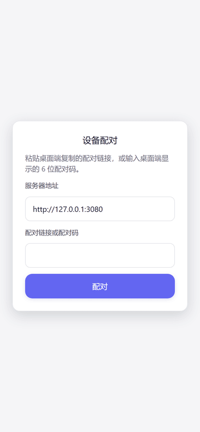

The standalone mobile surface for the [dsh](https://github.com/deepseek-ai/deepseek-harness) web GUI: scan-to-pair device trust, the `/m/` phone UI, the `/m/api` RPC channel with a realtime SSE mux bridge, and a desktop pairing panel.

## Attribution

dsh-palm is a **derivative work** of [dsh-remote-web-ui](https://github.com/zhu1090093659/dsh-web) (`@linxin666/dsh-remote-web-ui`, Apache-2.0, by zhu1090093659). See [NOTICE](packages/dsh-palm/NOTICE) for details.

## Screenshots

> The captures below are rendered by the real `/m/` UI against **fictional
> demo data** (workspace names, session titles and chat content are made up),
> so nothing private leaks into the repository.

| | |
|---|---|
| 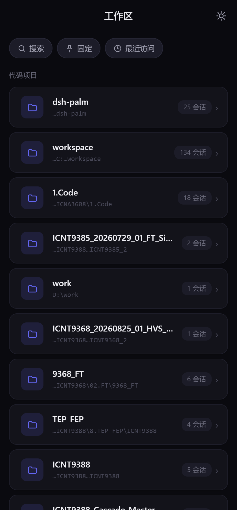 | **Workspace** — project roster with search, pin and recent |
| 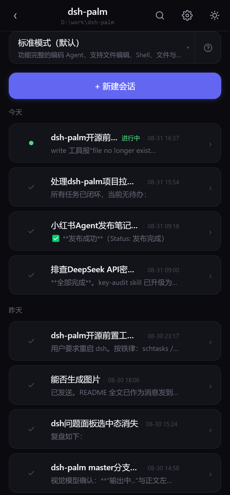 | **Session list** — per-project sessions grouped by day, with a new-session button |
| 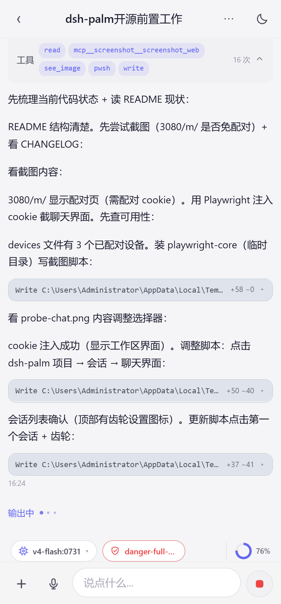 | **Chat** — streaming markdown with tool tags, interactive diff cards and syntax-highlighted code blocks |
| 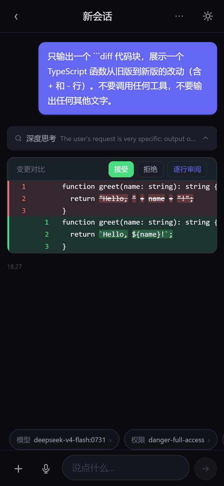 | **Diff cards** — `diff` fences render as interactive cards with accept / reject actions |
| 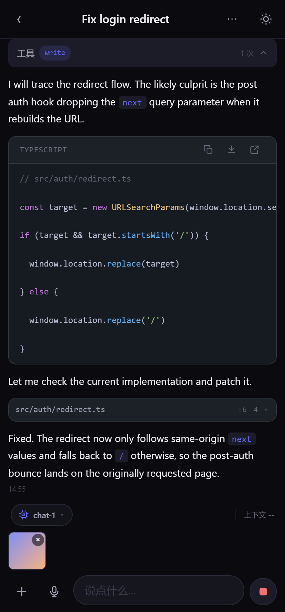 | **Image attach** — paste or pick images, auto-compressed before send |
| 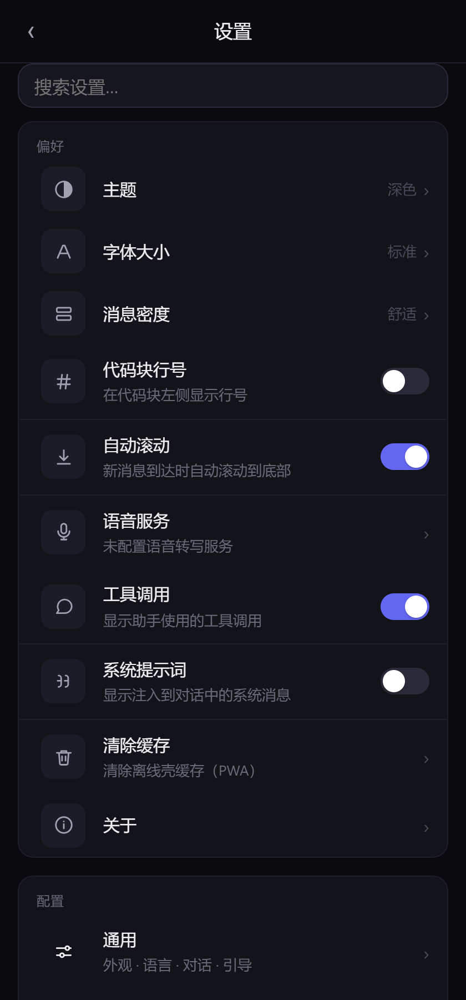 | **Settings** — display, theme and message-visibility preferences |
|  | **Run status** — the todo plan and background jobs share a live strip above the toolbar (2 of 6 tasks done, 1 background job running) |
| 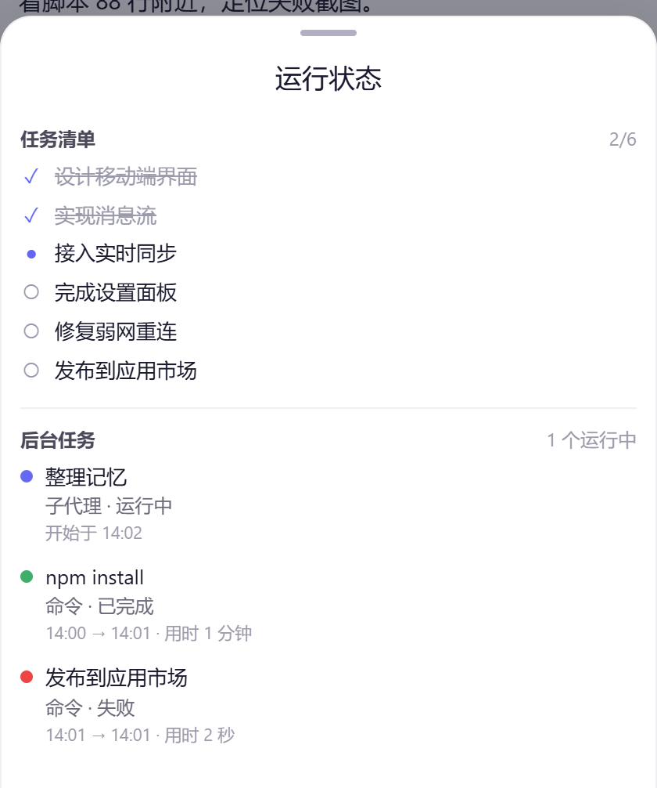 | **Task sheet** — tapping the strip opens both lists: the task list (✓/●/○, struck-through when done) and background jobs (kind, status, timing) |
| 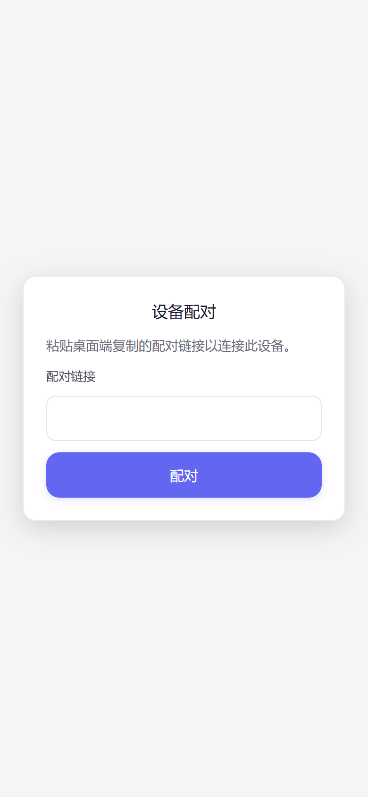 | **Pairing** — scan-to-pair device trust |
| 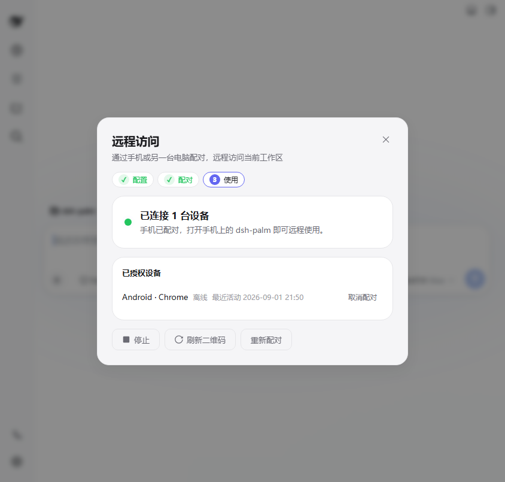 | **Pairing panel (use view)** — the desktop wizard lands on a clean device-management view once a phone is paired: status card, device roster, stop / refresh / re-pair |
| 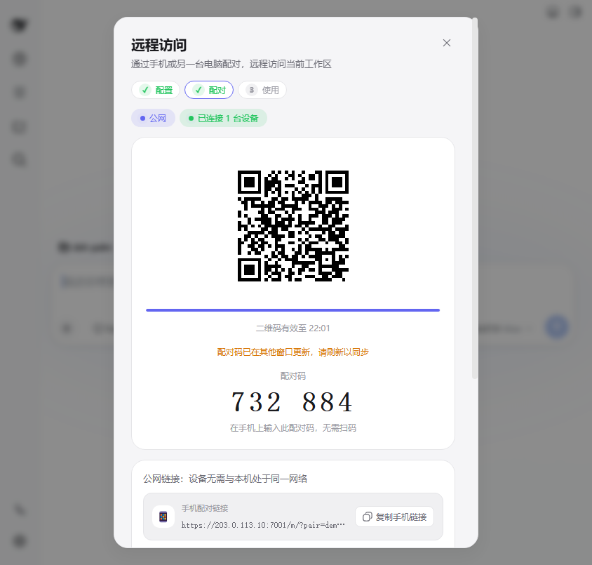 | **Pairing panel (pair view)** — QR code plus a six-digit pairing code the phone can type, phone/computer links, and the in-panel public-address editor |

## Highlights

The following are independent innovations over the upstream [dsh-remote-web-ui](https://github.com/zhu1090093659/dsh-web) (the pairing/trust model above is inherited from it).

**Architecture**

- **Native phone UI (`/m/`)** — a standalone mobile bundle designed for narrow screens from the ground up, not a CSS adaptation of the desktop GUI: touch-first interactions (draggable bottom sheets with pull-up expand and tap-outside dismiss), safe-area and dynamic-viewport handling, thumb-sized touch targets, zero horizontal scrolling; upstream desktop UI refactors never break the phone
- **Zero-dependency render stack** — hand-rolled GFM-subset markdown renderer (escape-first, protocol allow-list), lightweight syntax highlighter, unified-diff parser; ~888 KB bundle (209 KB gzip)
- **Method-level whitelisted RPC** — `/m/api` exposes an explicit allow-list plus phone-local methods; errors never leak host paths or method names

**Realtime**

- **Desktop-phone live sync** — both surfaces share one host event stream; measured end-to-end latency (desktop trigger → phone mux frame): loopback median 4 ms, public tunnel median 9 ms, Tailscale median 13 ms, weak network (200 ms simulated latency) median 246 ms
- **SSE mux bridge with polling fallback** — stall detection (36 s for a live stream) arms adaptive history polling; events are never lost and the stream switches back the moment SSE delivers again; a revoked device stops polling and returns to the pairing page instead of polling forever
- **Windowed streaming renderer** — only the visible prefix renders; long replies stay smooth
- **Incremental streaming preview** — the open tail renders as escaped text grown per chunk (O(chunk) per frame, no per-chunk full re-scan), with inline markdown promoted on short blocks; no typewriter cursor
- **Collapsible reasoning blocks** — in-body thinking folds into a disclosure

**Interaction**

- **Diff cards** — tolerant unified-diff parsing with word-level LCS marking, accept / reject / review actions, multi-file edits merged at their call-time points; stable references across streaming chunks (no per-token reflow)
- **Code actions** — copy, insert into editor, open, download, sandbox run; file-path tokens link to the host opener
- **Command cards** — slash-command discovery and execution with running / success / error lifecycle
- **Approval & question panels** — tool approvals stream in realtime and resolve in place; answers are bound to the owning device session (no cross-device stealing)
- **Run-status strip & task sheet** — todo plans (`todo/write` snapshots) and background jobs (`session/jobs`) collapse into one compact strip above the toolbar; tapping opens a bottom sheet with both lists — plan rows (✓/●/○, completed struck through) and job rows (kind, live status, start/end timing), in-flight first
- **Image attach** — paste or pick; canvas compression keeps payloads under a fixed budget; over-limit and decode failures surface as toasts instead of silent drops
- **Voice input & transcription** — in-browser WAV recording (auto-finishes at 60 s, cleans up on leave), OpenAI-compatible multi-service fallback (SenseVoiceSmall first), phone-managed service list; host-configured services are shown as display facts only — host API keys never leave the host
- **Plugin market** — browse, search and install plugins from the phone
- **Session management** — delete sessions from the chat menu or a long-press on the roster; the offline outbox is cleared with the session
- **IME-safe composer** — Chinese input-method composition never sends half-typed text

**Offline & weak networks**

- **PWA** — installable, versioned service worker, offline-capable bundle
- **Offline outbox** — prompts queue in IndexedDB (memory fallback) and flush automatically on reconnect; a sending flag prevents duplicate delivery after a crash; individual entries can be removed, permanently-failed entries are dropped
- **gzip-compressed API responses** — weak-link friendly
- **On-demand loading** — thin roster fetch; sessions load only when opened

**Experience**

- **Desktop-parity settings** — phone settings sync with the desktop (schema forms, cascading model picker, permission presets)
- **Display preferences** — font scale, density, line numbers, auto-scroll
- **Theme sync** — the desktop theme preference applies on the phone
- **Session roster** — full project names, cwd-filtered, full timestamps

**Pairing & onboarding**

- **Six-digit pairing code** — the desktop panel shows a human-readable code beside the QR; the phone can type it instead of scanning (codes are one-time, expire with the token, and die on re-issue or stop)
- **In-panel public-address editor** — configure your tunneled address (frp / Cloudflare Tunnel / Tailscale) right in the pairing panel; saving probes reachability first, so a dead tunnel is caught before it is persisted
- **Three-step wizard** — the panel is a configure → pair → use wizard; the step indicator doubles as navigation (completed steps are clickable), and paired users land directly on a clean device-management view
- **Tunnel detection** — the host probes for Tailscale (tailnet domain, one-click apply), parses `frpc.toml` for the concrete frp entry, and spots Cloudflare Tunnel clients; a first-time user with no tunnel gets a LAN / create-a-tunnel fork instead of a blank wall
- **First-run guidance** — a dismissible welcome banner, an unconfigured dot on the sidebar trigger, and plain-language copy ("Your phone cannot reach this computer") with the action right below it
- **Workspace-native theming** — the panel follows the system light/dark scheme via `prefers-color-scheme` (no manual toggle), with a 0.2s ease transition on every color
- **Phone-side server switch** — the mobile pairing gate shows the server address and deep-links a code/token to a switched tunneled origin via `?code=` / `?pair=`
- **Desktop-parity command menu** — the phone's `+` menu resolves the session's agent view, so per-agent commands (`/plan`, `/compact`) match the desktop `/` popup

## Features

- **Scan-to-pair device trust** — pair a phone by scanning a QR code; devices persist in `$DSH_HOME/remote-web-ui-devices.json` and keep working after switching install sources
- **Desktop pairing panel** — manage paired devices from the dsh web GUI
- **`/m/` phone UI** — chat, workspace, approvals, image upload; code blocks with syntax highlighting, line numbers and diff cards
- **`/m/api` RPC channel** — method whitelist + channel rules, with an `events.mux` SSE bridge for realtime updates
- **Run-status strip & task panel** — the todo plan and background jobs share one entry point above the composer; both stream live from host snapshots
- **Desktop-phone live sync** — one shared event stream; measured end-to-end latency: loopback 4 ms, public tunnel 9 ms, Tailscale 13 ms (median)
- **Clean streaming output** — windowed prefix rendering, incremental escaped-tail preview, no typewriter cursor
- **Collapsible reasoning blocks** — in-body thinking folds into a disclosure
- **Diff cards** — `diff` fences render as interactive cards with accept / reject / review actions
- **Code actions** — copy, insert into editor, open, download, sandbox run; file-path tokens link to the host opener
- **Command cards** — slash-command discovery and execution with running / success / error lifecycle
- **Approval & question panels** — tool approvals stream in realtime and resolve in place
- **Image attach** — paste or pick; canvas compression keeps payloads under a fixed budget
- **Voice input & transcription** — in-browser WAV recording, OpenAI-compatible multi-service fallback (SenseVoiceSmall first)
- **Plugin market** — browse, search and install plugins from the phone
- **Session delete** — from the chat overflow menu or a long-press on the roster; clears the offline outbox for that session
- **PWA** — installable, versioned service worker, offline-capable bundle
- **Offline outbox** — prompts queue in IndexedDB and flush automatically on reconnect; crash-safe (sending flag), per-entry removal
- **gzip-compressed API responses** — weak-link friendly
- **On-demand loading** — thin roster fetch; sessions load only when opened
- **Desktop-parity settings** — phone settings sync with the desktop (schema forms, cascading model picker, permission presets)
- **Display preferences** — font scale, density, line numbers, auto-scroll
- **Theme sync** — the desktop theme preference applies on the phone
- **Session roster** — full project names, cwd-filtered, full timestamps

## Install

Requires dsh >= 0.1.1-rc.1.

From npm:

```sh
dsh plugin --profile web add @eternalloveone/dsh-palm
```

From source:

```sh
git clone https://github.com/Eternalloveone/dsh-palm.git
dsh plugin --profile web add link:/path/to/dsh-palm/packages/dsh-palm
```

Already-paired devices keep working after switching install sources (same format as dsh-remote-web-ui).

## Remote access setup

Open the pairing panel from the sidebar phone icon. It walks you through three steps: **configure → pair → use**.

1. **Configure** — enter a public address the phone can reach (frp / Cloudflare Tunnel / Tailscale). The panel detects tunnels on your machine and suggests concrete entries; saving verifies reachability first.
2. **Pair** — scan the QR or type the six-digit pairing code on the phone.
3. **Use** — paired devices are managed from a clean status view.

A full walkthrough with a worked frp topology (server frps + nginx TLS, client frpc, panel configuration, verification, FAQ) lives in the [remote access guide](packages/dsh-palm/docs/remote-access-guide.md).

## Development

```sh
pnpm install        # in packages/dsh-palm
pnpm test           # vitest full suite
pnpm typecheck      # tsc -b
pnpm build          # tsc -b && tsdown -> lib/index.js + lib/mobile.js
```

Local push gate (repo hygiene + tests + commitlint before every push):

```sh
git config core.hooksPath scripts/hooks
```

## Architecture

- **Host half** (`src/`): pairing (`pairing.ts`), `/api/pair` routes (`routes.ts`), `api/gate` listener (`gate.ts`), `/m/` page routes (`mobile-routes.ts`), `/m/api` RPC channel with the `events.mux` SSE bridge (`mobile-api.ts`), method whitelist and channel rules (`remote-methods.ts`)
- **Mobile half** (`src/mobile/`): a standalone phone bundle — ChatView, workspace, approvals, image upload, mux, rpc, styles
- **Tests**: `tests/` + `src/**/*.test.*` (vitest)

## Security

Device trust is established by scan-to-pair; every `/m/api` call is gated by the pairing cookie and the method whitelist. The `/m/` surface serves a strict Content-Security-Policy as the last line of defense behind the renderer, host voice-transcription API keys never leave the host (the phone sees display facts only), approval answers are bound to the owning device session, and host error details are never echoed to the phone. See the pairing and gate sources for details, and [SECURITY.md](SECURITY.md) for the vulnerability reporting process and deployment notes.

## Project docs

- [CHANGELOG.md](CHANGELOG.md) — release history
- [CONTRIBUTING.md](CONTRIBUTING.md) — development setup and contribution guide
- [SECURITY.md](SECURITY.md) — vulnerability reporting

## License

Apache-2.0 — see [LICENSE](LICENSE). This is a derivative work of
[dsh-remote-web-ui](https://github.com/zhu1090093659/dsh-web); see
[NOTICE](packages/dsh-palm/NOTICE).
