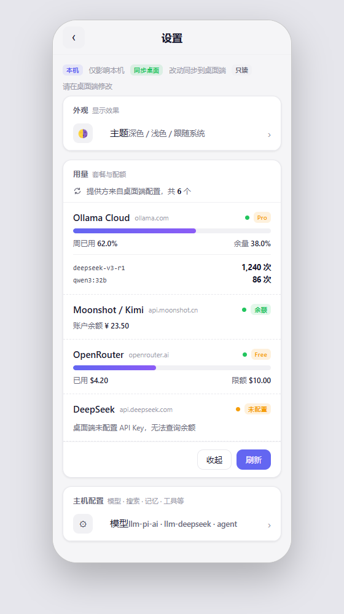

# dsh-palm

[English](README.md) | [简体中文](README.zh-CN.md)

[](https://www.npmjs.com/package/@eternalloveone/dsh-palm)
[](https://www.npmjs.com/package/@eternalloveone/dsh-palm)
[](https://github.com/Eternalloveone/dsh-palm/actions)
[](https://github.com/Eternalloveone/dsh-palm/blob/main/LICENSE)

**Status: pre-1.0** — the plugin API may change between releases; feedback welcome.


The standalone mobile surface for the [dsh](https://github.com/deepseek-ai/deepseek-harness) web GUI: scan-or-code device trust, the `/m/` phone UI, the `/m/api` RPC channel with a realtime SSE mux bridge, and a desktop pairing panel.

## Attribution

dsh-palm is a **derivative work** of [dsh-remote-web-ui](https://github.com/zhu1090093659/dsh-web) (`@linxin666/dsh-remote-web-ui`, Apache-2.0, by zhu1090093659). See [NOTICE](packages/dsh-palm/NOTICE) for details.

**Inherited:** the pairing protocol, the device-store format (`$DSH_HOME/remote-web-ui-devices.json`), and the desktop panel skeleton. **Independent:** the entire `/m/` UI, the render stack, the `/m/api` whitelist and SSE mux, and the offline layer.

## Product positioning

dsh-palm is a **narrow-screen-first, lightweight command deck**: the phone is for checking progress, acting on notifications, quick operations and light management — not a deep-work terminal. Complex configuration (installing plugins, editing permission presets) is best done on the desktop; the phone keeps the high-frequency path (open a session, read, reply) one or two taps away. Every component earns its place by **phone-scene frequency**: model switching, task and background-job status, session management are first-class; desktop-scene conveniences (card dashboards, multi-tab navigation, tree sidebars) are deliberately out of scope. The surface stays a single-page state machine (workspaces → sessions → chat) with bottom-sheet extensions — no tab architecture.

## Quick start

Your phone needs to reach this machine. Three ways:

- **Same Wi-Fi** (30 seconds, good enough) — open the pairing panel from the sidebar phone icon and use the LAN address it suggests.
- **Tailscale** (5 minutes, recommended) — install Tailscale on both devices; the panel detects your tailnet domain and applies it in one click.
- **frp or Cloudflare Tunnel** (1 minute if you already run one) — paste your tunneled address into the panel; it probes reachability before saving.

The panel auto-detects tunnels on your machine (Tailscale tailnet domain, `frpc.toml` entries, Cloudflare Tunnel clients) and gives first-time users with no tunnel a LAN / create-a-tunnel fork instead of a blank wall.

Then: `dsh plugin --profile web add @eternalloveone/dsh-palm` → open the pairing panel → scan the QR or type the six-digit code on the phone.

New here? The [30-second quickstart tutorial](packages/dsh-palm/docs/quickstart-tutorial.md) walks from install to a working phone conversation, and configures the completion notifications that make the phone surface worth having.

## Screenshots

| | |
|---|---|
|  | **Chat** — streaming markdown with tool tags, interactive diff cards and syntax-highlighted code blocks |
|  | **Diff cards** — `diff` fences render as interactive cards with accept / reject actions |
|  | **Run status** — the todo plan and background jobs share a live strip above the toolbar |
|  | **Pairing** — paste the desktop link or type the six-digit code |
|  | **Usage** — one settings card per provider configured on the desktop: consumed-quota meters, account balances and OpenRouter's spent-vs-limit, refreshed on demand |

More screenshots (workspace, sessions, image attach, settings, task sheet, pairing panel): [docs/screenshots](docs/screenshots/). All captures are rendered by the real `/m/` UI against **fictional demo data** (workspace names, session titles and chat content are made up), so nothing private leaks into the repository.

## Core capabilities

- **Scan-to-pair device trust** — pair a phone by scanning a QR code or typing a six-digit code; devices persist in `$DSH_HOME/remote-web-ui-devices.json` and keep working after switching install sources
- **Native phone UI (`/m/`)** — a standalone mobile bundle designed for narrow screens from the ground up, not a CSS adaptation of the desktop GUI: touch-first interactions, safe-area and dynamic-viewport handling, thumb-sized touch targets, zero horizontal scrolling
- **Realtime desktop-phone sync** — both surfaces share one host event stream over an SSE mux bridge with polling fallback; end-to-end latency (desktop trigger → phone mux frame, median): loopback 4 ms, public tunnel 9 ms, Tailscale 13 ms, weak network 246 ms (Chrome DevTools throttling, 200 ms simulated latency, N=5–8 rounds per scenario, 2026-08)
- **IME-safe composer** — Chinese input-method composition never sends half-typed text
- **Diff cards & code actions** — tolerant unified-diff parsing with accept / reject / review actions; copy, insert into editor, open, download, sandbox run
- **Run-status strip & task sheet** — the todo plan and background jobs collapse into one live strip above the toolbar
- **Offline outbox & PWA** — prompts queue in IndexedDB and flush automatically on reconnect; installable, versioned service worker
- **Completion notifications** — task-finished and long-reply alerts through three layers: in-app system notifications (SSE), Web Push (VAPID), and third-party channels (Server酱 / Bark / Telegram) for when the app is closed; thresholds and cooldowns are configurable from the phone
- **Per-provider usage & balances** — one settings card for every provider configured on the desktop: consumed-quota meters (Ollama Cloud), account balances (DeepSeek, Moonshot/Kimi) and OpenRouter's spent-vs-limit, refreshed on demand; providers without a public endpoint are not shown
- **Clean streaming output** — windowed prefix rendering keeps long replies smooth; collapsible reasoning blocks fold in-body thinking into a disclosure

## Full capability list

<details>
<summary>Architecture, realtime, interaction, offline, experience, pairing — the complete list</summary>

**Architecture**

- **Method-level whitelisted RPC** — `/m/api` exposes an explicit allow-list plus phone-local methods; errors never leak host paths or method names (covered by `tests/mobile-api.spec.ts`)
- **Hand-rolled render stack** — GFM-subset markdown renderer (escape-first, protocol allow-list), lightweight syntax highlighter, unified-diff parser — no third-party rendering dependencies; bundle under 1 MB (226 KB gzip)

**Realtime**

- **SSE mux bridge with polling fallback** — stall detection (36 s for a live stream) arms adaptive history polling; events are never lost and the stream switches back the moment SSE delivers again; a revoked device stops polling and returns to the pairing page instead of polling forever
- **Incremental streaming preview** — the open tail renders as escaped text grown per chunk, with inline markdown promoted on short blocks
- **Collapsible reasoning blocks** — in-body thinking folds into a disclosure

**Interaction**

- **Approval & question panels** — tool approvals stream in realtime and resolve in place; answers are bound to the owning device session (no cross-device stealing)
- **Command cards** — slash-command discovery and execution with running / success / error lifecycle
- **Image attach** — paste or pick; canvas compression keeps payloads under a fixed budget; over-limit and decode failures surface as toasts instead of silent drops
- **Voice input & transcription** — in-browser WAV recording (auto-finishes at 60 s, cleans up on leave), OpenAI-compatible multi-service fallback (SenseVoiceSmall first), phone-managed service list; host-configured services are shown as display facts only — host API keys never leave the host
- **Session management** — delete sessions from the chat menu or a long-press on the roster; the offline outbox is cleared with the session
- **Plugin market** — browse, search and install plugins from the phone (best done on the desktop)
- **Desktop-parity settings** — phone settings sync with the desktop (schema forms, cascading model picker, permission presets; complex presets are best edited on the desktop)

**Offline & weak networks**

- **PWA** — installable, versioned service worker, offline-capable bundle
- **gzip-compressed API responses** — weak-link friendly
- **On-demand loading** — thin roster fetch; sessions load only when opened
- **Instant navigation** — folded-view chat reads, batch previews and cross-mount caches make list/chat switching feel immediate, even over weak links

**Notifications**

- **One trigger, three channels** — the host watches the shared event stream and decides once (task terminal states + turns longer than a configurable threshold, with a per-session cooldown); every channel delivers the same decision
- **In-app system notifications (SSE)** — the phone shows a system notification while the app is open; clicking it deep-links to the session
- **Web Push (VAPID)** — the service worker receives pushes when the app is closed (Android Chrome/Edge/Firefox; iOS Safari 16.4+ for installed PWAs; mainland-China networks may not reach the FCM backend — the third-party channels cover that)
- **Third-party channels** — Server酱 (WeChat), Bark (iOS) and Telegram webhooks reach the phone with the app fully closed; credentials are stored host-side and never ride the settings surface
- **Notification settings** — permission, duration threshold, cooldown, Web Push toggle and channel credentials all live in the phone settings page, with a test button that pushes one synthetic event end to end

**Experience**

- **Display preferences** — font scale, density, line numbers, auto-scroll
- **Theme sync** — the desktop theme preference applies on the phone
- **Session roster** — full project names, cwd-filtered, full timestamps

**Pairing & onboarding**

- **Six-digit pairing code** — the desktop panel shows a human-readable code beside the QR; the phone can type it instead of scanning. Codes are one-time, expire with the token (10 minutes by default), and die on re-issue or stop; `/api/pair/accept` is rate-limited (30 s window: 40 attempts per source IP, 10 per XFF hop) and answers a uniform `invalid` for unknown or used secrets so probing cannot distinguish them
- **In-panel public-address editor** — configure your tunneled address (frp / Cloudflare Tunnel / Tailscale) right in the pairing panel; saving probes reachability first, so a dead tunnel is caught before it is persisted
- **Three-step wizard** — the panel is a configure → pair → use wizard; the step indicator doubles as navigation (completed steps are clickable), and paired users land directly on a clean device-management view
- **Tunnel detection** — the host probes for Tailscale (tailnet domain, one-click apply), parses `frpc.toml` for the concrete frp entry, and spots Cloudflare Tunnel clients; a first-time user with no tunnel gets a LAN / create-a-tunnel fork instead of a blank wall
- **First-run guidance** — a dismissible welcome banner, an unconfigured dot on the sidebar trigger, and plain-language copy ("Your phone cannot reach this computer") with the action right below it
- **Workspace-native theming** — the panel follows the system light/dark scheme via `prefers-color-scheme` (no manual toggle), with a 0.2s ease transition on every color
- **Phone-side server switch** — the mobile pairing gate shows the server address and deep-links a code/token to a switched tunneled origin via `?code=` / `?pair=`; the code is consumed immediately and the URL is replaced with a clean path, and every response carries `Referrer-Policy: no-referrer`
- **Desktop-parity command menu** — the phone's `+` menu resolves the session's agent view, so per-agent commands (`/plan`, `/compact`) match the desktop `/` popup

</details>

## Notifications

dsh-palm alerts the phone when a task finishes or a long reply completes. One host-side decision engine (`NotifyEngine`) watches the shared event stream and fans each decision out to three delivery layers, so the same event reaches the phone whether the app is open, closed, or the browser is gone entirely.

### How it works

**One trigger, three channels.** The host watches the mux stream and decides once:

- **Task terminal states** — a background job (bash, pwsh, …) transitioning `running → completed/failed` emits a notification immediately
- **Long turns** — a completed turn (agent reply) longer than the configurable threshold (default 30 s) emits a notification; the same session is throttled by a cooldown (default 2 min) so a burst of long replies does not spam the phone. Aborted and error turns never notify

The decision is delivered through three independent layers:

| Layer | Channel | Works when | Notes |
|---|---|---|---|
| L1 | SSE → Notification API | app open (foreground or background) | clicking deep-links to the session; suppressed while the page is visible |
| L2 | Web Push (VAPID) | app closed, browser running | Android Chrome/Edge/Firefox; iOS Safari 16.4+ installed PWA only; FCM may be unreachable from mainland-China networks |
| L3 | Server酱 / Bark / Telegram webhooks | app closed, browser gone | credentials stored host-side only |

**L1 (in-app).** The phone keeps one SSE connection to `/m/api/events.notify` — deliberately separate from the chat mux stream, whose schema drops unknown frames. A notify frame shows a system notification; clicking it deep-links to `/m/?workspace=…&session=…`. Notifications are suppressed while the page is visible: you are already looking at the app.

**L2 (Web Push).** The service worker (v4) receives pushes and shows the notification even when the app is closed, as long as the browser is running. VAPID keys are generated on first use and stored in `$DSH_HOME/dsh-palm-notify.json`; the phone subscribes through `pushManager` with the paired-device cookie as the subscription identity. Dead subscriptions (410/404 from the push service) are cleaned up automatically. Outbound delivery honors `DSH_PALM_PUSH_PROXY`, then `HTTPS_PROXY` / `HTTP_PROXY` — FCM is unreachable from some networks (mainland China) without a proxy.

**L3 (third-party).** Server酱 (WeChat), Bark (iOS) and Telegram webhooks reach the phone with the app fully closed and the browser gone. Credentials are stored host-side and never ride the settings surface — the phone only sees whether each channel is configured.

### Usage

1. Open the phone settings page → **Notifications** card
2. Allow the notification permission when prompted
3. Tune the **duration threshold** (long-reply trigger) and **cooldown** (per-session throttle)
4. Toggle **Web Push** to subscribe the current browser (L2)
5. Optionally configure **L3 channels**:
   - **Server酱** — register at [sct.ftqq.com](https://sct.ftqq.com) (WeChat scan), copy the SendKey (`SCT…`) into the settings page
   - **Bark** — install the Bark app (iOS), copy its device key
   - **Telegram** — create a bot via @BotFather, get the bot token and your chat id
6. Press **发送测试** to push one synthetic event through the configured L3 channels end to end

### Notes

- L1 needs the app alive (the SSE connection); lock-screen or OS-killed browsers drop it
- L2 needs the browser running; some Android ROMs (OPPO/vivo, Xiaomi, Huawei) block the FCM channel even with Google services installed — use L3 there
- iOS Safari Web Push requires the PWA installed to the home screen (16.4+)
- The settings test button exercises L3 only; L2 is verified by completing a real task

## Install

Tested against **dsh 0.1.1-rc.1**. The plugin API between rc releases can change; if you run a different dsh version, verify the pairing panel and the `/m/` surface after installing.

From npm:

```sh
dsh plugin --profile web add @eternalloveone/dsh-palm
```

From source:

```sh
git clone https://github.com/Eternalloveone/dsh-palm.git
dsh plugin --profile web add link:/path/to/dsh-palm/packages/dsh-palm
```

Already-paired devices keep working after switching install sources (same format as dsh-remote-web-ui).

## Remote access setup

Open the pairing panel from the sidebar phone icon. It walks you through three steps: **configure → pair → use**.

1. **Configure** — enter a public address the phone can reach (frp / Cloudflare Tunnel / Tailscale). The panel detects tunnels on your machine and suggests concrete entries; saving verifies reachability first.
2. **Pair** — scan the QR or type the six-digit pairing code on the phone.
3. **Use** — paired devices are managed from a clean status view.

A full walkthrough with a worked frp topology (server frps + nginx TLS, client frpc, panel configuration, verification, FAQ) lives in the [remote access guide](packages/dsh-palm/docs/remote-access-guide.md).

## Performance

End-to-end latency of the `/m/` shell over each access path, measured from a
domestic client (20 sequential requests per path, Node HTTP client, 2026-09):

| Access path | min | P50 | P95 | max |
|---|---|---|---|---|
| Local loopback | 1 ms | 2 ms | 4 ms | 9 ms |
| frp direct (HTTP) | 10 ms | 14 ms | 27 ms | 35 ms |
| nginx TLS (trusted certificate) | 13 ms | 15 ms | 24 ms | 57 ms |
| Cloudflare Tunnel | 405 ms | 413 ms | 463 ms | 1209 ms |

The **nginx TLS path is the recommended public entry**: a trusted certificate
(PWA-installable) at near-direct latency. The Cloudflare Tunnel is a fallback
only — its edge detour costs roughly 20-30x latency on domestic networks.
Reproduce with `scripts/measure-paths.mjs` (URLs passed as arguments or via
`DSH_PALM_PATHS`).

## Development

```sh
pnpm install        # in packages/dsh-palm
pnpm test           # vitest full suite
pnpm typecheck      # tsc -b
pnpm build          # tsc -b && tsdown -> lib/index.js + lib/mobile.js
```

Local push gate (repo hygiene + tests + commitlint before every push):

```sh
git config core.hooksPath scripts/hooks
```

## Architecture

- **Host half** (`src/`): pairing (`pairing.ts`), `/api/pair` routes (`routes.ts`), `api/gate` listener (`gate.ts`), `/m/` page routes (`mobile-routes.ts`), `/m/api` RPC channel with the `events.mux` SSE bridge (`mobile-api.ts`), method whitelist and channel rules (`remote-methods.ts`)
- **Mobile half** (`src/mobile/`): a standalone phone bundle — ChatView, workspace, approvals, image upload, mux, rpc, styles
- **Tests**: `tests/` + `src/**/*.test.*` (vitest)

## Security

Device trust is established by scanning the desktop QR or typing the six-digit code; every `/m/api` call is gated by the pairing cookie and the method whitelist. The `/m/` surface serves this Content-Security-Policy as the last line of defense behind the renderer:

```
default-src 'self'; script-src 'self'; style-src 'self' 'unsafe-inline'; img-src 'self' data: blob: https: http:; connect-src 'self'; font-src 'self' data:; worker-src 'self'; manifest-src 'self'; base-uri 'none'; form-action 'none'; frame-ancestors 'none'
```

- **Unknown methods are refused and host error details are never echoed to the phone** — covered by `tests/mobile-api.spec.ts` (e.g. "does not leak the host command error message to the phone")
- **Revocation is server-side and immediate** — a revoked device's next gated request 403s at the `api/gate` listener; the phone stops polling and returns to the pairing page
- **Pairing codes are brute-force resistant** — `/api/pair/accept` is rate-limited (30 s window: 40 attempts per source IP, 10 per XFF hop), tokens expire after 10 minutes by default, and unknown or used secrets get one uniform `invalid` response (no validity oracle); covered by `tests/routes.spec.ts`
- **Host voice-transcription API keys never leave the host** — the phone sees display facts only
- **Approval answers are bound to the owning device session** — no cross-device stealing
- **Not audited** — this project has not undergone a third-party security audit, and the upstream dsh project is itself a developer preview. Review the pairing and gate sources before exposing a deployment beyond your trusted network

See [SECURITY.md](SECURITY.md) for the vulnerability reporting process and deployment notes.

## Project docs

- [CHANGELOG.md](CHANGELOG.md) — release history
- [CONTRIBUTING.md](CONTRIBUTING.md) — development setup and contribution guide
- [SECURITY.md](SECURITY.md) — vulnerability reporting

## License

Apache-2.0 — see [LICENSE](LICENSE). This is a derivative work of
[dsh-remote-web-ui](https://github.com/zhu1090093659/dsh-web); see
[NOTICE](packages/dsh-palm/NOTICE). English is the source of truth for this
README; the Chinese version follows it.
